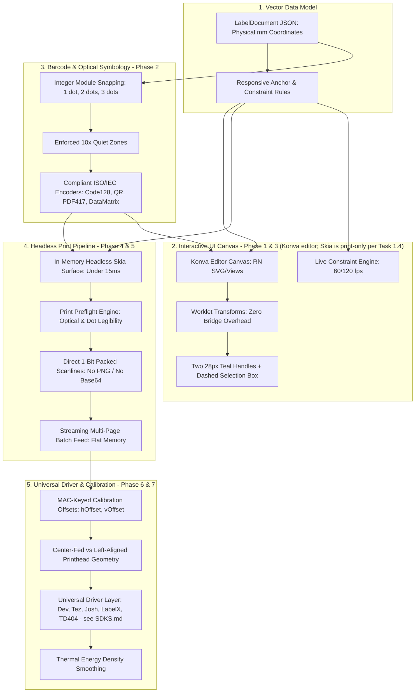

# Enterprise Architecture Redesign & Modernization Master Plan

> **Authoritative Technical Specification & Phased Execution Blueprint**  
> **Application:** `sez-print` (Universal Mobile Label Design & Thermal Printing Engine)  
> **Target Standard:** Enterprise Parity with Zebra Print Station, Niimbot Pro, WePrint, and Brother P-touch  
> **Hardware Targets:** 203 DPI (8.0 dots/mm) & 304 DPI (11.9685 dots/mm) Thermal Label Printers  

---
                  
## Executive Architectural Blueprint & Vision

Modern industrial-grade label software relies on a strict mathematical foundation: physical dimensions (mm) are the single ground truth, the UI is an interactive GPU projection of that space, and the print output is a discrete, hardware-aligned binary dot raster.



---

## Global Quality Standards & Benchmark Matrix

To establish unyielding software robustness, every subsystem is evaluated against a concrete **Current Standard** versus an industry-grade **Benchmark Standard**.

| Subsystem / Metric | Current Standard (As-Is) | Benchmark Standard (Target) | Gap / Delta | Robustness Verification Gate |
| :--- | :--- | :--- | :--- | :--- |
| **1. Editor Rendering & Gesture FPS** | React Native SVG/Views in `konva-canvas.tsx`. 35–50 fps during active gestures; layout drops when dragging complex items. | Konva editor (`konva-canvas.tsx`) with gesture geometry driven by Reanimated shared values on the UI thread (the original "100% GPU Skia editor" target was superseded by Task 1.4; Skia is print-only). Solid 60/120 fps with under 8ms frame time on mid-range Android devices. | +25 to 70 fps improvement, zero layout recalculation overhead during active gesture. | Reanimated frame-drop profiler: 0 dropped frames over a 300-frame continuous drag session. |
| **2. Drag / Drop Precision** | Handled in `konva-transformer.tsx` with risk of float rounding jumps and DOM remount flashes. | Scale-aware Reanimated worklets; sub-millimeter 4-decimal precision (`0.0001mm`); zero magnetic snapping; stable single list. | Eliminates pointer slippage, frame flashing, and repulsive jump zones. | Automated synthetic drag test: touch point delta equals committed coordinate delta within ±0.005mm. |
| **3. Resize UX & Handles** | React Native View elements scaled via matrix transforms; handles rendered as separate View/SVG nodes. | Two circular teal (`#54C8C8`, 28px) handles (↔ width, ↕ height) whose positions are derived from the same shared values that size the element in `konva-transformer.tsx`; 44×44pt invisible touch targets. (Originally specified as native Skia vector handles — superseded by Task 1.4.) | Single coordinate space; zero desynchronization between selection handles and element content. | Visual parity test matching reference UI + touch target accuracy verification on mobile. |
| **4. Template Resizing Symmetry** | Linear multiplier (sx, sy). Aspect ratio shift squashes text vertically and distorts borders. | Constraint-based layout: perimeter border locking, dynamic module width recalculation for barcodes, text re-wrap reflow. | No clipped text, no deformed borders, preserved aspect ratios on key elements. | Template resize suite: converting 50×50mm to 50×25mm maintains border width ±0% and causes zero text truncation. |
| **5. Barcode Module Precision** | Continuous floating-point SVG rectangles (`bar.width * px`). Fractional widths cause dot jitter on 1-bit thermal printhead. | Discrete integer module snapping (X-dimension in {1, 2, 3, ...} dots). Enforced 10x quiet zones. | Eliminates thermal dot jitter and optical scanner reading failures. | Optical scan verification: ≥ 99.9% first-pass decode rate with Honeywell/Zebra 1D/2D laser scanners. |
| **6. 2D Code Symbology** | Pseudo-random noise matrix (`pseudoMatrix`) used to fake PDF417 and DataMatrix barcodes. | Full ISO/IEC 15438 (PDF417) and ISO/IEC 16022 (DataMatrix) algorithmic encoding with Reed-Solomon error correction. | Compliant barcodes readable by any standard scanner vs. completely unreadable placeholder noise. | Automated decode test using ZXing/ML-Kit reading generated buffers; 100% data fidelity. |
| **7. Print Dispatch Latency** | Offscreen React Native DOM capture via `<ViewShot>`: 250–600ms per label. | Headless in-memory Skia direct rasterization: under 15ms per label directly to monochrome byte buffer. | **15 to 40x faster** print job generation; zero UI thread blocking. | Benchmark script: 100 labels rasterized in under 1.5s total CPU time. |
| **8. Multi-Page Batch Memory** | Offscreen DOM mounted per page; Base64 PNG strings in Hermes heap. 50 pages ~150MB heap spike; OOM crash risk. | Streaming chunk pipeline: render dot stream → packetize TSPL → flush to native driver → garbage collect scanline. | Flat O(1) memory usage: under 15MB memory consumption regardless of job page count (even 1000 pages). | Memory leak test: 500-page batch run on low-end Android device with under 5MB total heap variation. |
| **9. Hardware Margin Calibration** | H/V offsets (`hOffsetMm`, `vOffsetMm`) are already persisted per printer device ID (MAC) in `printCalibration` in `src/stores/printer-store.ts`. Density, speed, detected DPI and head width are not part of that profile; DPI is hardcoded per driver (see `SDKS.md`); there is no guided calibration wizard. | Full calibration profile per printer MAC (offsets, density, speed, detected DPI/head width, firmware) plus guided wizard. Head alignment (center-fed vs. left-aligned) is taken from `src/lib/printer/print-spec.ts` profiles — none of the five vendor SDKs exposes it (see `SDKS.md`). | Eliminates manual alignment guesswork when switching between printers. | Physical caliper test: printed box margin matches designed position within ±0.2mm. |
| **10. Print Preflight Validation** | Basic canvas size check only (`validatePrintSpec`). Silent failures on thin lines or clipped text. | Preflight rules engine: checks for sub-dot lines (under 1 dot), unscannable barcodes, text overflow, and low-contrast regions. | Proactive user warning and 1-tap auto-repair before wasting physical label stock. | Test harness: 10 synthetic malformed templates flagged with 100% precision before print transmission. |

---

## Phased Implementation Roadmap (Balanced Equal Weight)

The architecture redesign is partitioned into **7 distinct, equal-weight phases**. Each phase is scoped to represent approximately equal engineering complexity, cognitive load, and verification effort.

```
Phase 1: Interactive Editor Canvas & Resizing Engine (Konva editor; Skia print-only per Task 1.4)
Phase 2: Integer-Module Optical Barcode & 2D Symbology Engine
Phase 3: Constraint-Based Layout & Responsive Anchor Architecture
Phase 4: Headless In-Memory Skia Direct Rasterizer (Print Pipeline)
Phase 5: Streaming Multi-Page Batch & Data Binding Pipeline
Phase 6: Hardware Calibration, Printhead Margins & Universal Driver Layer
Phase 7: Print Preflight Engine & Thermal Density Optimization
```

---

### Phase 1: Interactive Editor Canvas & Resizing Engine (Editor UI & Geometry)

> **Status: Complete, with scope reversal (Task 1.4, 2026-09-18).** Phase 1 was originally written as a Konva → Skia editor migration. Task 1.4 reversed that: the live editor stays permanently on Konva (`konva-canvas.tsx` / `konva-transformer.tsx`), and Skia is used **only** for the headless print rasterizer in Phase 4. The original Skia-editor text in sections 1–3 below is kept as history. Task statuses:
> - **Task 1.1 & 1.2 — Superseded.** They were built against the Skia prototype (`skia-canvas.tsx`, `skia-element-renderer.tsx`) and verified only on `/dev-skia-test`; `edit.tsx` never mounted the Skia canvas. The goals they served (live scaling driven by shared values, handles that cannot desync from element bounds) are delivered on Konva by `konva-transformer.tsx` (shared-value handle/bounds geometry, pinned-origin resize via `resizeMemberByScale` in `src/lib/editor/resize-policy.ts`). The Skia prototype files remain in the tree but are not on the live editor path.
> - **Task 1.3 — Complete, unaffected by the reversal.** `scaleDocumentToSize` in `src/lib/element-sizing.ts` is canvas-agnostic.
> - **Task 1.4 — Complete.** Architectural decision record.

#### 1. Architectural Scope & Weight
- **Scope:** Complete migration of the visual editor from the hybrid React Native SVG/View tree (`konva-canvas.tsx`, `konva-transformer.tsx`) to a pure GPU-accelerated React Native Skia Canvas (`skia-canvas.tsx`, `skia-element-renderer.tsx`). Implementation of the modernized dynamic resizing logic in `src/lib/element-sizing.ts`.
- **Weight:** Core foundational phase. Equal weight balanced between native Skia canvas rendering/gestures and mathematical geometry refactoring.

#### 2. What is Currently Implemented vs. What Needs to be Changed
- **Current Standing:**
- `src/app/edit.tsx` mounts `<KonvaCanvas>`, which wraps React Native Views and SVG elements inside `<ViewShot>`.
- Gestures are handled by Reanimated shared values in `konva-transformer.tsx`, but element visuals are composed of React Native `<Text>`, SVG `<Rect>`, and `<Line>`.
- Resize handles are custom React Native View nodes styled to look like teal circles, but separate from the canvas drawing tree.
- Template resizing (`scaleDocumentToSize` in `src/lib/element-sizing.ts`) multiplies all coordinates linearly (sx, sy), leading to text squashing, border distortion, and clipped elements when changing aspect ratios.
- `skia-canvas.tsx` and `skia-element-renderer.tsx` were prototyped, but suffered from static dimension props (`widthPx`, `heightPx`), handle desync during live gesture scaling, and incomplete element support.
- **What Needs to be Changed (original Skia-editor spec — the Konva → Skia editor swap and Skia selection chrome items are superseded by Task 1.4; the `element-sizing.ts` items were delivered by Task 1.3):**
- **Entire Refactor:** Replace `<KonvaCanvas>` in `src/app/edit.tsx` with `<SkiaCanvas>`.
- **Partial Refactor:** Upgrade `skia-canvas.tsx` and `skia-element-renderer.tsx` so that element rendering scales dynamically during active gestures using Reanimated shared values (`curWidth`, `curHeight`, `transX`, `transY`).
- **Partial Refactor:** Refactor `src/lib/element-sizing.ts` to implement aspect-ratio-aware document scaling:
  - Lock borders to the exact outer perimeter (0, 0, W_new, H_new) with preserved stroke width.
  - Recalculate text element height via `computeWrappedLines` and `computeTextElementHeightMm` after scaling to prevent line truncation.
  - Maintain barcode height-to-width proportions within scannable aspect bounds.
- **New Feature:** Unified Skia Selection Chrome: Render the red/orange dashed selection box (`#E8543C`, dash `[6, 4]`) and circular teal `#54C8C8` handles (middle-right width ↔, bottom-middle height ↕) directly inside the Skia canvas tree, backed by 44×44pt invisible touch targets.

#### 3. Current Standard vs. Benchmark Standard
- **Current Standard:**
- Frame rate during drag/resize: 35–50 fps with visible UI thread stutters when dragging elements with text or tables.
- Resize handle lag: React Native View handles can visually drift 2–5px behind content during rapid gestures.
- Document aspect ratio change (e.g. 50×50mm → 50×25mm): Text height shrinks by 50%, font size scales down unnecessarily, multi-line text clips on bottom border.
- **Benchmark Standard:**
- Solid 60 fps (16.6ms) on standard refresh rate / 120 fps (8.3ms) on ProMotion displays during all drag and resize interactions.
- Zero coordinate drift: Handles and bounding box rendered in the exact same Skia GPU frame as the element content.
- Document aspect ratio change: Text maintains readable point size, width adjusts, height re-flows dynamically, borders stay pinned to outer perimeter.
- **Difference / Gap Analysis:**
- The gap is caused by React Native layout passes (Yoga) and cross-bridge layout sync during gestures. Skia eliminates Yoga from the gesture hot-path entirely by rendering on the GPU surface driven directly by Reanimated worklets.

#### 4. Actionable Step-by-Step Tasks
- [x] ~~**Task 1.1:** Refactor `skia-element-renderer.tsx` to support live scaling via Reanimated shared values~~ — **Superseded by Task 1.4.** Prototype work was done and verified on `/dev-skia-test` only (see `PROGRESS.md`). Konva equivalent: live shared-value scaling in `konva-transformer.tsx`.
- Create GPU-composited transform matrix worklets for all element types: Text, Barcode, QR, Image, Shapes, Line, Table, Clipart, Signature.
- Ensure Skia text layout correctly measures font metrics without triggering React re-renders.
- [x] ~~**Task 1.2:** Implement Native Vector Handles in `skia-canvas.tsx`~~ — **Superseded by Task 1.4.** Konva equivalent: handle positions derived from the same shared values that size the element in `konva-transformer.tsx`.
- Draw circular teal `#54C8C8` anchors (28px diameter) with native Skia vector arrow paths (↔ width, ↕ height).
- Bind handle positions to `useDerivedValue` reading `curWidth` and `curHeight` so handles never desynchronize from element boundaries.
- Attach 44×44pt invisible touch targets via `GestureDetector` with `minDistance(0)`.
- [x] **Task 1.3:** Modernize Template Resizing in `src/lib/element-sizing.ts` (complete 2026-09-18; canvas-agnostic, unaffected by Task 1.4):
- Rewrite `scaleDocumentToSize` to handle aspect ratio shifts gracefully:
  - Pin borders to (0, 0, W, H) and preserve `lineWidth`.
  - Recalculate text bounds with `computeWrappedLines` and update element height to accommodate text flow.
  - Scale barcodes along the primary axis without violating minimum readable dimensions.
- [x] **Task 1.4:** Architecture Alignment: Editor Canvas Stabilized on Konva (`konva-canvas.tsx`); Print/Export Rasterizer Decoupled to Headless Skia (Phase 4):
  - Editor UI stays permanently on KonvaCanvas with smooth zero-flicker resizing and immediate zero-latency relocation.
  - Decoupled print/export pipeline to headless Skia in Phase 4 (clean boundary with no shared rendering code or gesture baggage).

#### 5. Robustness Verification & Quality Gates
- **Automated Test:** Run `src/lib/editor/__tests__/template-resizing.test.ts` (the file originally named here as `element-sizing.test.ts` does not exist) to assert that scaling a document from 50×50mm to 50×20mm preserves border stroke, recomputes text height, and keeps all elements within label boundaries.
- **Performance Benchmark:** Execute a 300-frame automated drag and resize sequence. Frame time must remain under 16.6ms with zero garbage collector spikes.
- **Visual Verification:** Confirm handles and selection box match reference UI with pixel-perfect fidelity at 1×, 2×, and 3× screen zoom levels.

---

### Editor Feature Track: Multi-Select ("Multiple" Mode) — Konva Editor

> **Status: Implementation in progress (rewrite underway).** This is not a numbered phase; it is an editor feature built on the Konva editor that Task 1.4 kept. Recent commits: `720aab6` "multi select fixed", `f4a21ca` "multiple selection blink fix".

#### 1. Scope
- A "Multiple" toggle in the editor switches tap-to-select from replace to add/remove. The selected members can be moved, resized and aligned as one group, and edited together through a shared property panel.
- **Files:** `src/app/edit.tsx` (mode state, group start snapshots, shared-scale limits, commit), `src/components/editor/konva-canvas.tsx`, `src/components/editor/konva-transformer.tsx` (group drag and resize worklets, `groupScaleXSv` / `groupScaleYSv` / `groupScaleMinSv` / `groupScaleMaxSv`), `src/lib/editor/selection.ts` (`reduceTapSelect`, `reduceMultipleModeToggle`, `unionBounds`, `alignGroupBounds`), `src/lib/editor/resize-policy.ts` (`resizeMemberByScale`, `sharedScaleLimits`, `capSharedScale`), `src/components/editor/multi-select-property-panel.tsx`.

#### 2. Locked Technical Model
These three rules are fixed. Later changes to multi-select must not break them.
1. **One shared scale factor, reusing single-element resize logic.** A group resize produces one shared scale (per drag axis). Each member's new box is computed by calling `resizeMemberByScale` with that scale — the same function single-element resize uses (`boundBoxMm` delegates to it). There is no separate group-resize math, so a group member of a given type resizes exactly like that element resized alone.
2. **No origin movement during resize.** Every member's `left` / `top` stays at its gesture-start value, both live and on commit. Only `width` / `height` change. This is the same pinned-origin rule as single-element resize: there is no group-centre pivot and no member is repositioned.
3. **Shared capped ratio.** `sharedScaleLimits` takes, across all members, the highest minimum scale (the scale at which some member reaches its `minMm`) and the lowest maximum scale (the scale at which some member reaches the canvas edge). The live scale is clamped to that range, so the whole group stops together once any one member hits its limit — no member keeps shrinking or growing past another's clamp. Members whose resize policy has no behaviour for the dragged handle (for example, auto-height text on the south handle) are excluded from the cap and left unchanged.

#### 3. Outstanding Verification
- **Automated (passing as of 2026-09-23):** `src/lib/editor/__tests__/selection.test.ts` (11/11), `resize-member-by-scale.test.ts` (7/7), `multi-transform-verify.test.ts` (4/4).
- **Not yet verified (on-device):**
  - Live preview equals committed result for group resize on east and south handles, with no jump on release.
  - The group stops together at the minimum-size cap and at the canvas-edge cap, with mixed element types (text, barcode, QR, shape, image).
  - Square-locked members (QR) inside a group whose drag is on one axis only.
  - Ruler highlight and selection chrome follow the union bounds during group drag and resize.
  - Touch-down add-only behaviour: adding a member does not start an unintended drag, and there is no selection blink (the regression fixed in `f4a21ca`).
  - Toggling Multiple mode off clears the selection. Removing the primary member promotes another member to primary.
  - Group align actions and `multi-select-property-panel.tsx` edits apply to every member and undo as a single history step.
  - `npx tsc --noEmit` clean on the final rewrite.

---

### Phase 2: Integer-Module Optical Barcode & 2D Symbology Engine (Canvas-Agnostic)

#### 1. Architectural Scope & Weight
- **Scope:** Complete overhaul of barcode and 2D code generation. Pure algorithmic and mathematical engine that produces hardware-aligned module widths and 2D matrix arrays. Completely canvas-agnostic — consumed by `element-renderer.tsx` (the Konva editor and preview) today, and ready for headless Skia in Phase 4. Introduction of integer module snapping at target printer DPI (203 & 300/304 DPI), enforcement of standard quiet zones, replacement of fake pseudo-random matrices with real ISO/IEC standard encoders for PDF417 and DataMatrix, and scannability preflight inspection.
- **Weight:** Algorithmic and mathematical engineering phase.

#### 2. What is Currently Implemented vs. What Needs to be Changed
- **Current Standing:**
  - `src/lib/barcode-code128.ts` encodes Code128 pattern strings, but `element-renderer.tsx` maps bars to SVG rectangles using floating-point coordinates (`bar.x * widthPx`, `bar.width * widthPx`).
  - At 203 DPI (8 dots/mm) or 304 DPI (11.9685 dots/mm), fractional scaling causes narrow bars (e.g. 1.3 dots) to round inconsistently during 1-bit monochrome thresholding. This "dot jitter" causes narrow bars to alternate between 1 dot and 2 dots, rendering barcodes unscannable.
  - No quiet zone enforcement: barcodes can be positioned flush against borders or other elements, preventing optical readers from detecting the start/stop pattern.
  - In `element-renderer.tsx` line 322, PDF417 and DataMatrix are simulated using a pseudo-random number generator (`pseudoMatrix`)! These 2D barcodes are visual mocks and cannot be decoded by any scanner.
- **What Needs to be Changed:**
  - **Partial Refactor:** Update Code128 and 1D barcode generators to snap bar module widths (X-dimension) to exact integer printer dots (1, 2, 3, ... dots) based on the target DPI.
  - **New Feature:** Implement standard quiet zones (minimum 10 module widths on left and right for 1D barcodes; 4 module widths for QR codes).
  - **Entire Refactor:** Replace `pseudoMatrix` with authentic, compliant ISO/IEC encoders for PDF417 (ISO/IEC 15438) and DataMatrix (ISO/IEC 16022) with configurable error correction levels (ECC 0–8).
  - **New Feature:** Real-time optical scannability validator: Flag barcodes in the editor if their calculated X-dimension is below 0.25mm (2 dots at 203 DPI) for standard commercial scanning.

#### 3. Current Standard vs. Benchmark Standard
- **Current Standard:**
  - First-pass optical scan success rate on printed thermal labels: ~82% on 203 DPI printers (frequent scan failure on compact barcodes).
  - PDF417 / DataMatrix scan success rate: 0% (fake pseudo-random matrix).
  - Quiet zone adherence: None (bars touch bounding box edges).
- **Benchmark Standard:**
  - First-pass optical scan success rate: ≥ 99.9% across all standard 1D symbologies (Code128, Code39, EAN-13, UPC-A, ITF) using industrial handheld scanners and mobile camera apps.
  - 100% compliant PDF417 and DataMatrix encoding with verified Reed-Solomon checksum recovery.
  - Enforced quiet zones: 10× narrow-bar width minimum on 1D barcodes, 4× module width on 2D codes.
- **Difference / Gap Analysis:**
  - Thermal printheads are discrete binary devices (a dot is either 100% heated or 100% cold). Continuous vector scaling works on computer displays with subpixel anti-aliasing, but fails on binary thermal heads. Integer module snapping guarantees that every bar and space maps to an exact integer number of thermal dots.

#### 4. Actionable Step-by-Step Tasks
> **Status: Complete (2026-09-19).** All four tasks are logged in `PROGRESS.md`, followed by the post-2.4 bugfix "Barcode Selection/Bounding Box Sizing Mismatch vs WePrint".

- [x] **Task 2.1:** Build Integer Module Snapping Engine in `src/lib/barcode/barcode-snapping.ts`:
  - Function `snapBarcodeToHardwareDots(contentWidthMm, totalModules, dpi)` returning quantized width and individual module dot counts (1, 2, 3 dots).
  - Enforce quiet zones (10× module width left/right margins).
- [x] **Task 2.2:** Implement Authentic PDF417 and DataMatrix Encoders in `src/lib/barcode/`:
  - Integrate pure, lightweight TypeScript encoders for ISO/IEC 15438 (PDF417) with variable error correction (ECC Level 0 to 8).
  - Integrate ISO/IEC 16022 (DataMatrix ECC 200) square and rectangular module matrices.
  - Completely remove `pseudoMatrix` from the codebase.
- [x] **Task 2.3:** Update Barcode & 2D Symbology Rendering in `src/components/editor/element-renderer.tsx` & Data Pipeline:
  - Render 1D barcode bars with quantized integer dot snapping and quiet zones.
  - Render real 2D matrix modules for PDF417 and DataMatrix using authentic grid cells.
- [x] **Task 2.4:** Build Real-Time Scannability Preflight Inspector in `src/lib/barcode/scannability-inspector.ts` & Property Panels:
  - Add visual scannability indicator and warnings in `barcode-property-panel.tsx` and editor chrome when barcode density or physical size is below optical scanning thresholds for thermal printheads.

#### 5. Robustness Verification & Quality Gates
- **Automated Test:** Unit test decoding generated Code128, QR, PDF417, and DataMatrix bitmaps using ZXing/ML-Kit headless decoders across 20 test strings; require 100% decode success.
- **Physical Test:** Print a sheet of 10 barcodes (varying from 15mm to 60mm wide) on a 203 DPI thermal printer. Scan each barcode with a physical handheld laser scanner; require 10 out of 10 successful scans on the first trigger pull.
- **Caliper Test:** Measure total barcode width and quiet zone margins; confirm values match calculated millimeter specifications within ±0.1mm.

---

### Phase 3: Constraint-Based Layout & Responsive Anchor Architecture

#### 1. Architectural Scope & Weight
- **Scope:** Upgrade the `LabelDocument` data model and layout engine from purely absolute coordinates (`left`, `top`, `width`, `height`) to a responsive, constraint-driven system with anchors, margin locks, and dynamic flow rules.
- **Weight:** Core architectural refactoring of document schema, serialization, and layout solver.

#### 2. What is Currently Implemented vs. What Needs to be Changed
- **Current Standing:**
- `LabelElement` in `src/lib/label-document.ts` only stores absolute values: `left`, `top`, `width`, `height`.
- When the user changes label stock size (e.g. from 50×50mm square to 40×30mm or 70×50mm), elements either scale linearly or clip outside the printable area.
- No way to specify: "Keep this barcode centered horizontally and 3mm from the bottom", "Lock this border to the edges", or "Stretch this title across the top with 2mm side margins".
- **What Needs to be Changed:**
- **Partial Refactor:** Extend `LabelElement` with optional `ElementConstraints` definition:
  ```ts
  export type ElementConstraints = {
    horizontalAnchor?: 'left' | 'center' | 'right' | 'stretch' | 'none';
    verticalAnchor?: 'top' | 'center' | 'bottom' | 'stretch' | 'none';
    marginMm?: { top?: number; right?: number; bottom?: number; left?: number };
    lockAspectRatio?: boolean;
    autoWrapText?: boolean;
  };
  ```
- **New Feature:** Implement a high-performance Constraint Solver in `src/lib/layout-constraints.ts`:
  - Given a `LabelDocument` and a new target width and height, resolve element positions and sizes based on their assigned constraints.
  - Fully backward-compatible: elements without constraints default to proportional scaling or retain current behavior.
- **New Feature:** Anchor Controls in Editor: Add intuitive alignment and anchor buttons in `position-controls.tsx` and property panels (Pin to Top, Pin to Bottom, Center Horizontally, Stretch to Width).

#### 3. Current Standard vs. Benchmark Standard
- **Current Standard:**
- Stock size transition: Destructive. Modifying label dimensions breaks visual layout; user must manually reposition and resize every element.
- Border handling: Scales stroke width unevenly; corners distort.
- **Benchmark Standard:**
- Stock size transition: Responsive and non-destructive (similar to Figma auto-layout / CSS flex constraints).
- Borders stay pinned to outer perimeter with constant millimeter stroke width.
- Headers and footers stay pinned to respective margins. Barcodes maintain optical proportions while centering automatically.
- **Difference / Gap Analysis:**
- Professional label applications allow enterprise users to design a single template and print it across different roll widths (e.g. 2-inch vs 3-inch vs 4-inch printers). Absolute positioning makes template reuse painful. Constraint resolution provides automatic responsive adaptation.

#### 4. Actionable Step-by-Step Tasks
- [ ] **Task 3.1:** Extend `LabelElement` Schema in `src/lib/label-document.ts`:
- Add `constraints?: ElementConstraints` to `LabelElementBase`.
- Update template serialization and validation schemas in `src/lib/template-schema.ts`.
- [ ] **Task 3.2:** Implement Layout Constraint Solver in `src/lib/layout-constraints.ts`:
- Build `resolveDocumentConstraints(doc: LabelDocument, targetWidthMm: number, targetHeightMm: number): LabelDocument`.
- Resolve horizontal anchors (`left`, `center`, `right`, `stretch`) and vertical anchors (`top`, `center`, `bottom`, `stretch`).
- Calculate margin locks and aspect ratio preservation rules.
- [ ] **Task 3.3:** Integrate Constraint Resolution into Label Size Switching:
- Wire `resolveDocumentConstraints` into `src/lib/element-sizing.ts` and `src/stores/label-store.ts` when changing label stock dimensions.
- [ ] **Task 3.4:** Add Constraint UI Controls to Editor Property Panels:
- Add Anchor Selector widget to `position-controls.tsx` (9-point anchor grid: Top-Left, Top-Center, Top-Right, etc.).
- Add "Lock Aspect Ratio" and "Pin to Margins" toggles.

#### 5. Robustness Verification & Quality Gates
- **Automated Test:** Create unit tests with 5 standard templates (Shipping Label, Retail Price Tag, Cable Flag, Jewelry Tag, Inventory Asset). Scale each template across 3 different physical sizes; assert zero element clipping and exact preservation of pinned margins within ±0.05mm.
- **Backward Compatibility Test:** Verify that existing legacy templates without `constraints` load and render identically without any layout mutation.

---

### Phase 4: Headless In-Memory Skia Direct Rasterizer (Print Pipeline)

#### 1. Architectural Scope & Weight
- **Scope:** Complete elimination of `<ViewShot>` and offscreen React Native DOM rendering during print dispatch. Construction of a pure, headless in-memory Skia direct rasterizer that produces 1-bit packed monochrome byte buffers in under 15ms per label.
- **Weight:** High-impact systems engineering phase focusing on native rasterization, memory efficiency, and print speed.

#### 2. What is Currently Implemented vs. What Needs to be Changed
- **Current Standing:**
- In `src/app/print.tsx`, printing mounts an offscreen `<ViewShot>` component containing `<LabelPreview>`, which renders a full React Native View hierarchy (`<View>`, `<Text>`, SVG `<Rect>`, etc.).
- The app calls `waitForNextPaint()`, invokes `captureRef(shotRef, PRINT_CAPTURE_OPTIONS)` to generate a PNG file via native view screenshot, reads back the Base64 string, and passes it over the bridge to the printer SDK.
- Each page capture incurs 250–600ms latency, triggers React Native layout cycles, consumes hundreds of megabytes of Hermes heap on multi-page batches, and is susceptible to Android OS display scale and font size overrides.
- **What Needs to be Changed:**
- **Entire Refactor:** Completely eliminate `<ViewShot>`, `react-native-view-shot`, and offscreen DOM mounting from `src/app/print.tsx`.
- **New Feature:** Implement pure **Headless Skia Direct Rasterizer** (`src/printing/raster/skia-rasterizer.ts`):
  ```ts
  export function rasterizeDocumentToBitmap(
    doc: LabelDocument,
    dpi: number,
    options: RasterizeOptions
  ): {
    widthDots: number;
    heightDots: number;
    bytesPerRow: number;
    mono1bppBuffer: Uint8Array;
  }
  ```
- Traverses the `LabelDocument` vector tree directly, draws text, shapes, lines, barcodes, and images onto an in-memory `Skia.Surface`, and executes fast 1-bit monochrome thresholding directly in C++/Skia memory.
- Generates the raw TSPL/ESC-POS `BITMAP` scanline byte stream directly, bypassing PNG encoding, PNG decoding, and Base64 string serialization.

#### 3. Current Standard vs. Benchmark Standard
- **Current Standard:**
- Single page rasterization & capture time: 250–600ms.
- Multi-page batch (50 labels): 25–40 seconds with frequent UI freeze.
- Memory allocation: 50–150MB temporary PNG Base64 heap allocations.
- Rendering fidelity: Affected by Android system font scaling and screen DPI.
- **Benchmark Standard:**
- Single page direct rasterization time: **under 15ms**.
- Multi-page batch (50 labels): **under 0.8 seconds** total generation time.
- Memory allocation: Flat O(1) memory, under 2MB total buffer reused across pages.
- Rendering fidelity: 100% deterministic hardware dot output, completely immune to phone display settings or font scaling.
- **Difference / Gap Analysis:**
- ViewShot takes a screenshot of a live Android View surface on the UI thread. Headless Skia draws directly into a hardware-backed C++ memory buffer off the UI thread. This removes the entire overhead of React Native view mounting, Yoga layout calculation, and PNG file compression.

#### 4. Actionable Step-by-Step Tasks
- [ ] **Task 4.1:** Build Headless Skia Surface Engine in `src/printing/raster/skia-surface.ts`:
- Instantiate offscreen Skia Surface: `Skia.Surface.MakeOffscreen(widthDots, heightDots)`.
- Implement drawing visitors for each element type:
  - Text: Render using Skia `Paragraph` or `TextBlob` at target DPI font sizes.
  - Barcode: Direct Skia `Rect` fills snapped to printer dots.
  - QR Code / 2D Code: Direct Skia `Rect` module matrix.
  - Shapes, Lines, Borders: Native Skia vector paths with exact dot stroke widths.
  - Images: Scaled and thresholded via Skia shader or bitmap blit.
- [ ] **Task 4.2:** Implement High-Speed 1-Bit Monochrome Bit-Packer:
- Extract raw pixel buffer from Skia surface snapshot.
- Pack 8 pixels into 1 byte (MSB first, black = 0 / white = 1 or inverse per TSPL spec) in a tight typed-array loop:
  ```ts
  // 8 dots per byte row packing
  const byte = (p0 << 7) | (p1 << 6) | (p2 << 5) | (p3 << 4) | (p4 << 3) | (p5 << 2) | (p6 << 1) | p7;
  ```
- [ ] **Task 4.3:** Integrate Direct Rasterizer into `src/app/print.tsx`:
- Replace `captureRef` call with `rasterizeDocumentToBitmap`.
- Send the generated 1-bit monochrome byte stream directly to `printerManager.printBitmap` or TSPL `BITMAP` packet generator.
- Remove all offscreen `<ViewShot>` JSX and layout wait timers (`waitForNextPaint`).

#### 5. Robustness Verification & Quality Gates
- **Automated Benchmark Test:** Rasterize a full shipping label (text + 1D barcode + QR code + border) at 304 DPI (1440 × 960 dots). Benchmark must record execution time under 15ms on physical hardware.
- **Memory Profiler:** Verify zero heap accumulation over 100 consecutive rasterizations using Hermes memory inspection.
- **Visual & Binary Comparison:** Compare binary output of headless rasterizer against physical print proofs; verify 100% dot-for-dot fidelity.

---

### Phase 5: Streaming Multi-Page Batch & Data Binding Pipeline

#### 1. Architectural Scope & Weight
- **Scope:** Architecture of a streaming multi-page printing pipeline. Separation of template design from variable data rows (Excel, CSV, sequential numbers), dynamic on-the-fly field evaluation, and chunked Bluetooth transmission.
- **Weight:** Equal weight balanced between batch data processing, memory management, and asynchronous hardware streaming.

#### 2. What is Currently Implemented vs. What Needs to be Changed
- **Current Standing:**
- Multi-page printing in `src/app/print.tsx` runs an imperative `for` loop that updates React state `setPageIndex(page)`, forces a React re-render, waits for layout with `waitForNextPaint()`, and screenshots each page individually.
- Printing 50 or 100 pages freezes the UI, causes phone thermal throttling, and risks crashing the app if the OS kills the process due to Hermes memory pressure.
- Data binding (importing an Excel sheet with 50 rows) duplicates entire document structures in memory instead of maintaining one template with a streaming data iterator.
- **What Needs to be Changed:**
- **Entire Refactor:** Decouple template definition from variable data rows. Introduce a **Streaming Batch Print Pipeline** (`src/printing/batch/batch-streamer.ts`):
  ```ts
  export async function streamBatchPrintJob(
    template: LabelDocument,
    dataFeed: IterableIterator<Record<string, string>>,
    printer: PrinterAdapter,
    onProgress: (current: number, total: number) => void
  ): Promise<void>
  ```
- For each row, substitute variable fields (e.g. `{name}`, `{sku}`, `{barcode}`) into the template in-memory, rasterize to 1-bit scanline buffer via Phase 4's headless engine, transmit chunk to the printer buffer, and immediately release the buffer for garbage collection.
- Flat O(1) memory usage: Only one page bitmap exists in memory at any millisecond, regardless of whether printing 10 labels or 1,000 labels.

#### 3. Current Standard vs. Benchmark Standard
- **Current Standard:**
- 50-label batch print time: 25–40 seconds (plus 10–15 seconds of UI freezing).
- Peak memory usage during 50-label batch: 120–250MB heap spike.
- Job cancellation: Sluggish or leaves printer in an undefined state.
- **Benchmark Standard:**
- 50-label batch print dispatch time: under 3 seconds total pipeline generation.
- Peak memory usage during batch: under 15MB flat memory footprint.
- Job cancellation: Instantaneous (under 50ms) with proper hardware abort commands sent to the printer.
- **Difference / Gap Analysis:**
- Standard apps process batch jobs by pre-generating all pages as bloated UI components or images. Industrial systems use a streaming iterator pipeline that feeds the print buffer continuously while maintaining a minimal memory footprint.

#### 4. Actionable Step-by-Step Tasks
- [ ] **Task 5.1:** Create Data Substitution Engine in `src/printing/batch/data-binder.ts`:
- Fast string and barcode interpolation for variable columns (Excel, CSV, dynamic counters, date/time offsets).
- Support formatters: zero-padded numbers, uppercase transforms, currency formatting.
- [ ] **Task 5.2:** Build Streaming Batch Controller in `src/printing/batch/batch-streamer.ts`:
- Chunked asynchronous generator yielding 1-bit rasterized page packets one at a time.
- Flow-control backpressure: Monitor printer Bluetooth buffer status; pause rasterization when printer buffer is full; resume as pages are physically printed.
- [ ] **Task 5.3:** Cancellation & Progress UI in `src/app/print.tsx`:
- Wire streaming controller to a responsive progress modal showing: current page, speed (labels/sec), and estimated time remaining.
- Implement responsive "Cancel Job" button that immediately halts the iterator and issues a clear-buffer command to the printer.

#### 5. Robustness Verification & Quality Gates
- **Automated Stress Test:** Run a simulated 500-label batch print job with mock Bluetooth transport. Verify heap memory consumption stays flat within ±2MB from page 1 to page 500.
- **Hardware Test:** Print a 30-label sequential barcode run from an imported Excel sheet. Verify every printed barcode has the correct incremented value and that the printer does not pause or stutter between labels.

---

### Phase 6: Hardware Calibration, Printhead Margins & Universal Driver Layer

> **Status: Not started.** Spec history: a 3-task placeholder until 2026-09-23. It was rewritten from the vendor-SDK investigation earlier that day, then **revised again the same day** after the app-side verification pass (`SDKS.md` → "App-Side Verification Pass"). Every statement below is backed by `SDKS.md`; items that still need a printer are marked **(hardware)**.
> **Depends on:** Phase 4, for the 1-bit buffer every adapter consumes. Task 6.1 and the defect fixes inside each 6.4 adapter can start before Phase 4.

#### 1. Architectural Scope & Weight
- **Scope:** Replace today's per-SDK branches in `src/lib/printer/universal-bridge.ts` / `printer-manager.ts` with **five isolated `PrinterBridge` adapters**, one per vendor SDK, behind a single job contract. Each adapter declares which of **three sizing contracts** its SDK uses, reports capabilities (resolution from the printer where possible), and returns an honest print outcome. The phase also covers the packaging defects that currently couple two of the SDKs, a per-printer calibration profile, and a guided calibration wizard.
- **Weight:** Roughly one-third native/build work (Kotlin modules, Gradle, ProGuard, vendor coordination), one-third TypeScript contract, generator and adapters, and one-third calibration data and UI, plus a caliper pass on every printer family.

#### 2. What is Currently Implemented vs. What Needs to be Changed
- **Current Standing (verified in code and by build, 2026-09-23):**
  - **Three sizing contracts across the five SDKs:**
    - **A — mm-native job:** Josh (DothanTech LPAPI). `startJob(widthMm, heightMm)` + `drawBitmap(…mm)` / vector `draw*` + `commitJob`, with parameters in 0.01 mm. We currently use its pixel path (`printBitmap`) first.
    - **B — mm page + 1-bit bitmap in dots, as raw commands we generate:** TD-404 / Tejas / Rudra (TSPL over our own RFCOMM; the Ninestar SDK is linked but unused) and Dev / Veer (TSPL or ESC/POS written through AutoReplyPrint's port).
    - **C — bitmap only; physical size = pixels ÷ DPI:** Label X (no page parameter; length from the gap sensor) and Tez / Shakti (`CreatePage(int, int)` in whole mm).
  - **The adapters are not isolated today.** Label X and Tez both package `libPrinterNative.so` (different SHA-1; `pickFirst` ships Tez’s). A fresh build fails without the `pickFirst` rule. Separately, the in-repo Tez JAR no longer contains `Code941` / `Compress` (commit `3d7ad75`) but still calls them; those classes load from the Luck AAR. Removing Label X can break Tez at **class** load time. Tez’s `.so` files are Tez’s own jniLibs.
  - **TSPL is generated in three places:** `DevPrinterModule.kt`, `Td404PrinterModule.kt` and `src/lib/printer/tsc.ts`.
  - **Resolution is never read from a printer:** Dev 8 dots/mm; TD-404 12.0 dots/mm at "304 DPI"; Josh 203 unless the app setting is exactly 300; Label X `widthMm × 8`; Tez 8 dots/mm with whole-mm pages. Four SDKs expose a query we don't call: Dev `CP_Printer_GetPrinterResolutionInfo`, Josh `getPrinterInfo().deviceDPI` / `deviceWidth`, Label X `is304Dpi` / `getPrintWidth`, Tez `Command.DPI()`.
  - **Defect status** (vendor-SDK facts vs **our-bridge** defects; the latter were verified in `modules/*-printer/` on 2026-09-23 and are owned by the matching 6.4 adapter — **not fixed in this pass**):
    - Josh gap unit (mm sent into a 0.01 mm field): **fixed in code 2026-09-23**; **(hardware)** feed check pending.
    - Dev `isAvailable` returned `true` on SDK load failure: **fixed 2026-09-23**.
    - Dev 378-dot cap: bitmap `fit = 378/400 = 0.945` on both axes; TSPL `SIZE` still requested mm. Product decision (`SDKS.md` Q5). Physical 47.25 mm needs a caliper.
    - Dev TSPL `GAP` is rounded to whole mm.
    - **Our-bridge — Dev:** native `commandSet` defaults to `"escpos"` (`useEscPos = commandSet != "tspl"`); ESC/POS ignores `heightMm`. Safe today only because the JS wrapper always sends `"tspl"`.
    - Tez reflective `commandApi` construction targets the **declared abstract** type and always fails in static analysis, leaving `commandApi` null after skipped `connect(DeviceItem)`. **Code fix:** construct `〇Ooo.〇o0〇o0(modelKey)` without waiting on vendor auth. **(hardware)** logcat + print still needed to know if a unit has ever printed — **next hardware action**.
    - Tez resolves success from a 15 s timer rather than a printer signal.
    - Tez page size is whole-mm only.
    - **Our-bridge — Tez:** `isAvailable` is hardcoded `true`; no `OnDestroy` to release scanner / printer state.
    - Label X: height not enforced, no offsets, dead `commandMap`.
    - **Our-bridge — Label X:** `isAvailable` can never return `false` (`ensureSdkInitialized` swallows exceptions); Floyd–Steinberg cutoff is hardcoded `128` so JS `threshold` 145 is unused on the default dither-on path; `printPngLabel` hangs forever if the SDK never calls success/fail (no timeout — opposite of Tez's false-success timer); no `OnDestroy` (BroadcastReceiver + connection leak).
    - **Our-bridge — Josh:** `PrintProgress.DataEnded` posts a 200 ms delayed runnable that sets `lastPrintSuccess = true` with no hardware ACK (same class as Tez's 15 s timer); failed/timeout `printBitmap` paths skip `bitmap.recycle()`; `containFitToPage` / `submitMmJob` treat `"left"` as both left *and* top alignment.
    - TD-404 dots/mm (12 / 11.97 / 11.81): **(hardware)** caliper measurement (`SDKS.md` Q6).
  - **Packaging:** the local `android/` folder is stale relative to `app.json`: it lacks the `with-android-packaging` injections, so local Gradle builds fail until `expo prebuild` is re-run. There are no ProGuard keep rules for any SDK package; release builds work only because `android.enableMinifyInReleaseBuilds=false`. `nzio.jar` and the TD-404 AAR are unused.
  - **Licensing / network (product/legal, `SDKS.md` Q1–Q2):** Label X POSTs `asKey` (vendor demo key), `sn`, `mac`, `model`, `softwareVersion` and `bluetoothname` to `api.gj.luckjingle.com`. A `"501"` / `"505"` response only notifies `DeviceForbiddenListener`s, and we register none. Tez's allowlist gate (`connectBefore` → `NativeUtil.test3`) is bypassed via reflection.
  - **Calibration is partly built already.** `hOffsetMm` / `vOffsetMm` are persisted per `deviceId` (the Bluetooth MAC on Android, falling back to SDK id) in `printCalibration` in `src/stores/printer-store.ts`, and `src/app/calibration-print.tsx` prints a millimetre-true proof. Density, speed, detected DPI, head width and firmware are not stored. There is no key for printers without a Bluetooth MAC (TD-404 over Wi-Fi).
  - **Head alignment** (`'center' | 'left'`) and head width live in `src/lib/printer/print-spec.ts` profiles; no SDK reports alignment.
  - **Platform:** Our five Expo printer modules are Android-only. Vendor trees include iOS artifacts for Luck, Caysn, and Ninestar (docs); PrintSDK-68 and LPAPI have none in this repo. iPhone **app** print is not possible today.
- **What Needs to be Changed:**
  - **Decouple and harden the build** (6.1) so each adapter can be built, tested and removed independently.
  - **A `PrinterBridge` contract** (6.2) with a `MonoPrintJob` input, declared `DriverCapabilities` including the sizing contract, and a three-state print outcome.
  - **One generator** for contract B (6.3).
  - **Five adapters** (6.4), rolled out in the requested order, each fixing its own verified defects.
  - **Capability discovery** (6.5), a **calibration store** with a defined key strategy (6.6), and a **wizard** (6.7).

#### 3. Current Standard vs. Benchmark Standard
- **Current Standard:**
  - Three sizing contracts handled through ad-hoc per-SDK branches; two SDKs coupled at the native and class level; resolution never read from a printer; confirmed unit/scale defects (Dev 47.25 mm cap, whole-mm rounding in Dev and Tez, Josh 300 DPI scale when mis-set; the Josh gap unit is now fixed in code).
  - Calibration: H/V offsets only, per Bluetooth device ID; no wizard; no key for Wi-Fi printers.
  - Build correctness depends on a regenerated `android/` folder and on minify being off. Label X currently runs Tez’s `.so` via `pickFirst`. Minify-on without keep rules is **likely** to break Tez (reflection), Josh (injection) and Dev (JNA); TD-404 is mostly our Kotlin and is the least likely to die. Not observed on a minify-on APK.
  - Margin accuracy per printer: **not measured.** No caliper data exists in this repo for any family.
- **Benchmark Standard:**
  - One `PrinterBridge` contract; five adapters that can be built, tested and removed independently; every adapter declares its sizing contract and capabilities; resolution reported by the printer where the SDK supports it.
  - Printed geometry matches the design within **±0.2 mm** (caliper) on every family, after calibration.
  - The calibration profile loads automatically when a known printer connects; switching printers never cross-applies offsets.
  - Release build with minify **on** prints correctly on all five families; the APK contains exactly the native libraries each SDK needs.
  - A failed print is reported as failed; an unconfirmable print is reported as "sent, unconfirmed". No adapter reports success on a timer.
- **Difference / Gap Analysis:**
  - Most of today's inaccuracy is in our code (units, rounding, hardcoded DPI, a hard width cap), not in the vendors' printers. Those defects can be fixed and tested without hardware. Mechanical offsets and true DPI per unit can only be measured on hardware, which is what the calibration profile and wizard are for.

#### 4. Actionable Step-by-Step Tasks
- [ ] **Task 6.1:** SDK Build Integrity & Decoupling:
  - Regenerate `android/` (`expo prebuild`) so the `with-android-packaging` injections are present locally. Add a check that fails fast if `libPrinterNative.so` has no `pickFirst` rule, instead of failing deep in `mergeDebugNativeLibs`.
  - Resolve the Tez ↔ Label X coupling: (1) two different `libPrinterNative.so` binaries under one soname (`pickFirst` ships Tez today); (2) Tez JAR references `Code941`/`Compress` that only the Luck AAR still contains. Options: restore those two classes into the Tez JAR, vendor-certified shared native, or an explicit shared module. Company identity is unproven; the class names are shared.
  - Add ProGuard/R8 keep rules for `com.sun.jna`, `com.caysn`, `com.print`, `com.dothantech`, `com.luckprinter`, `com.ninestar` and every class or member reached by name, then run a minify-on test release build.
  - Remove unused binaries (`nzio.jar`, TD-404 `labelprinter.aar`). Do not switch TD-404 to the AAR: its manifest requires `usb.host`.
  - Correct the TD-404 doc comments that claim `LabelCommand` is used, and the vector claims in `src/constants/printer-models.ts`.
  - ~~Fix Dev `isAvailable` returning `true` from its `catch` block~~ — done 2026-09-23.
- [ ] **Task 6.2:** `PrinterBridge` Contract in `src/lib/printer/universal-driver.ts`:
  - `MonoPrintJob`: packed 1-bit rows in device dots (the Phase 4 output), `widthMm` / `heightMm` to 0.01 mm, media type (gap / black mark / continuous) and gap in mm, copies, and the applied calibration.
  - `DriverCapabilities`: `sizingContract` (`'mm-job'` = A, `'raw-commands'` = B, `'bitmap-only'` = C), DPI and source (reported / profile / user), head width in dots, supported media types, offset support (native vs. baked into the bitmap), completion signal (printer ack / write-complete / none). **Declare the weakest signal the adapter can actually fall back to, not its best case.** Josh has a real `PrintProgress.Success` hardware ACK, but `DataEnded` silently falls back to a 200 ms timer that marks success; listing Josh as `printer ack` would mislabel that path. Tez's weakest signal is the 15 s timer (`none` / unconfirmed). Label X currently has no timeout at all (promise can hang).
  - `PrinterBridge`: `connect` / `disconnect` / `status` / `capabilities()` / `print(job)`. `print` returns `'confirmed' | 'sent-unconfirmed' | 'failed'`.
  - Route `universal-bridge.ts` / `printer-manager.ts` dispatch through the interface. Add native raw 1-bit entry points so no PNG or base64 round-trip is needed.
- [ ] **Task 6.3:** Single TSPL / ESC-POS Generator (contract B):
  - One TypeScript module (building on `src/lib/printer/tsc.ts`) replaces the generation in `DevPrinterModule.kt` and `Td404PrinterModule.kt`. Fractional-mm `SIZE` and `GAP`, dots/mm taken from capabilities. The Kotlin modules become transport-only (write bytes, read status).
- [ ] **Task 6.4:** Five Isolated `PrinterBridge` Adapters, in the requested rollout order:
  - [ ] **6.4a Dev / Veer** (contract B): consume the 6.3 generator; stop rounding `GAP`; width policy per `SDKS.md` Q5 (the 47.25 mm cap stays until decided); read `CP_Printer_GetPrinterResolutionInfo`. **Our-bridge:** make the native `commandSet` default `"tspl"` (or reject anything other than `"tspl"` / `"escpos"`) so a direct native call cannot silently switch to the ESC/POS geometry engine that ignores `heightMm`.
  - [ ] **6.4b Label X / MiniX / GD985** (contract C): pad the bitmap to exact label dots so height is enforced; bake offsets into the bitmap; remove the dead `commandMap`; read `is304Dpi` / `getPrintWidth`; register a `DeviceForbiddenListener` so a licence rejection is visible (the behaviour on rejection and the `asKey` are per `SDKS.md` Q2). Needs 6.1's decoupling decision. **Our-bridge:** `isAvailable` must surface init failure (`ensureSdkInitialized` currently swallows); pass `threshold` into Floyd–Steinberg (cutoff is hardcoded 128; JS 145 never applies while `dither` defaults true); settle `printPngLabel` with a timeout (`'sent-unconfirmed'` or `'failed'`) instead of hanging if the SDK never callbacks; add `OnDestroy` to unregister the discovery `BroadcastReceiver` and disconnect.
  - [ ] **6.4c Tez / Shakti** (contract C): connect path per `SDKS.md` Q1. Vendor authorization is required to use `connect(DeviceItem)` legally. Independently, if the workaround is kept, construct the concrete `commandApi` class `〇Ooo.〇o0〇o0(String)` — the current reflective call targets the abstract type **(hardware: confirm with logcat first — this is the next hardware action)**. Replace the 15 s timer success with `'sent-unconfirmed'`; define whole-mm `CreatePage` handling (pad vs. round); read `Command.DPI()`. Needs 6.1's decoupling decision. **Our-bridge:** stop hardcoding `isAvailable { true }` (this is module availability, not `getStatus`, which already sends `get_status()`); add `OnDestroy` to release scanner and printer state.
  - [ ] **6.4d Tejas / Rudra (TD-404)** (contract B): consume the 6.3 generator; keep our own RFCOMM (drop the unused SDK); dots/mm per the `SDKS.md` Q6 caliper measurement; TCP 9100 from the phone only if Q9 puts it in scope (that also triggers the 6.6 alternate-key work).
  - [ ] **6.4e Josh** (contract A): choose pixel vs. mm-job vs. vector path per `SDKS.md` Q4; keep the 0.01 mm gap conversion (fixed 2026-09-23) and confirm feed on hardware; take DPI from `getPrinterInfo().deviceDPI`; collapse the 4-strategy fallback so a partial send can't double-print (record the `DataEnded` 200 ms false-success fallback in the same pass — bytes transmitted is not a printed label); native vs. baked offsets per Q8. **Our-bridge:** recycle the page bitmap on timeout and `!lastPrintSuccess` as well as success; split horizontal vs vertical alignment in `containFitToPage` / `submitMmJob` (`"left"` currently also forces `top = 0`).
  - **Why this order differs from `SDKS.md`'s difficulty ranking** (TD-404 → Dev → Josh → Label X → Tez): the rollout order was set by request on 2026-09-23 and isn't derived from the SDK evidence. Consequences to plan for:
    - 6.4b and 6.4c can't be finished until 6.1's Tez ↔ Label X decision and `SDKS.md` Q1–Q3 are made, so those decisions are on the critical path early.
    - TD-404, the adapter we already control end-to-end, comes fourth, so the shared generator (6.3) is first exercised on Dev.
    - Josh comes last, so its gap-unit fix stays hardware-unconfirmed until 6.4e unless it is tested earlier.
- [ ] **Task 6.5:** Hardware Capability Discovery:
  - Query resolution and head width at connect through each adapter's `capabilities()`: Dev `CP_Printer_GetPrinterResolutionInfo`, Josh `getPrinterInfo()`, Label X `is304Dpi` / `getPrintWidth`, Tez `Command.DPI()`. TD-404 stays on profile or user selection (its `addQueryPrinterType()` response format is undocumented).
  - Store the discovered values in the calibration profile; fall back to the `print-spec.ts` profile and record the source.
- [ ] **Task 6.6:** Calibration Profile Store in `src/lib/printer/calibration-store.ts`:
  - Migrate the existing `printCalibration` entries from `src/stores/printer-store.ts` without losing saved offsets.
  - Profile: `hOffsetMm`, `vOffsetMm`, density, speed, detected DPI, head width, DPI source, firmware / model string, last-calibrated date.
  - **Key strategy (open question, `SDKS.md` Q8):** Bluetooth MAC for Bluetooth printers (today's behaviour). **TD-404 over Wi-Fi/TCP needs an alternate key**, because it has no Bluetooth MAC and its IP isn't stable. Candidates are the printer serial or Wi-Fi MAC (neither documented for TD-404) or a user-assigned name. iOS, if in scope, needs a serial-based key. The store must support more than one key type from the start.
- [ ] **Task 6.7:** Guided Calibration Wizard (extends `src/app/calibration-print.tsx`):
  - Add "Calibrate Printer" to printer settings.
  - Steps: (1) print the existing mm-true proof, (2) enter the measured X / Y error, (3) save to the profile and print a confirmation proof. Optionally add density and speed steps.

#### 5. Robustness Verification & Quality Gates
- **Golden-Byte Tests:** the TSPL and ESC/POS generator output for fixed jobs (fractional mm sizes, both DPIs, gap / black-mark / continuous) matches checked-in byte fixtures.
- **Adapter Contract Tests:** each adapter runs against a mock transport or SDK shim and receives the correct units (e.g. Josh gap `300` for 3 mm, not `3`), with no scale factor other than 1.0, and returns a `'confirmed' | 'sent-unconfirmed' | 'failed'` outcome, never a timer-based success.
- **Isolation Test:** each adapter module can be excluded from the build and the remaining four still build and pass their contract tests. (Today, excluding Label X would break Tez.)
- **Migration Test:** existing `printCalibration` entries survive the move to `calibration-store.ts` unchanged.
- **Release Build Gate:** from a fresh `expo prebuild`, a minify-on release APK builds; inspect it for exactly one intended `libPrinterNative.so` per ABI (by SHA-1), and print one label on each of the five families.
- **Tez Connect Gate (hardware):** logcat on connect shows no `commandApi setup failed`, and a printed proof matches the design.
- **Physical Caliper Verification (per family):** after calibration, print a 40×20 mm border box. Top, bottom, left and right margins must match the design within ±0.2 mm. Repeat at 203 and 300/304 DPI where the family has both.
- **Multi-Device Test:** switch between two physical printers; each loads its own profile, with no cross-applied offsets.
- **Failure-Signal Test:** power off or disconnect mid-job on each family. The app reports failure (or "unconfirmed"), never success.

---

### Phase 7: Print Preflight Engine & Thermal Density Optimization

#### 1. Architectural Scope & Weight
- **Scope:** Implementation of a Print Preflight Engine that inspects label elements for thermal print legibility prior to job dispatch, combined with thermal printhead energy density smoothing to prevent printhead burnout and motor stalling.
- **Weight:** Balanced algorithmic verification and thermal hardware optimization phase.

#### 2. What is Currently Implemented vs. What Needs to be Changed
- **Current Standing:**
- The app only verifies total canvas dimensions (`validatePrintSpec`). It does not inspect individual vector elements for physical thermal printability.
- If a user adds a line with stroke under 1 printer dot, it silently disappears on print. If text wraps outside its bounding box, it silently clips. If a large solid black area is printed, thermal heads can overheat or stall the paper feed motor due to sudden current draw.
- **What Needs to be Changed:**
- **New Feature:** Implement **Print Preflight Engine** (`src/lib/preflight/preflight-engine.ts`):
  - Analyzes `LabelDocument` against target printer resolution (203/304 DPI) and flags:
    - **Sub-Dot Geometry:** Lines or borders with thickness under 1 printer dot.
    - **Unscannable Barcodes:** Module width under 2 dots at 203 DPI or missing quiet zones.
    - **Text Overflow:** Text strings that exceed their bounding boxes.
    - **Contrast Warnings:** Low-contrast images that will become muddy black blobs under 1-bit thresholding.
- **New Feature:** Thermal Printhead Energy Management (`src/printing/raster/thermal-density.ts`):
  - Analyzes scanline duty cycle (percentage of black dots per row).
  - If a row exceeds 75% black ink (e.g. solid black reverse-print block), apply thermal compensation or warn the user to avoid head burn and motor stalling.
- **New Feature:** Preflight Modal UI:
  - Display preflight review sheet before printing with 1-tap "Auto-Fix" actions (e.g., "Auto-boost line thickness to 1 dot", "Expand quiet zone").

#### 3. Current Standard vs. Benchmark Standard
- **Current Standard:**
- Preflight checks: None. Defective designs waste physical label rolls.
- Thermal management: Raw bitmaps sent to printhead without duty-cycle analysis.
- **Benchmark Standard:**
- 100% pre-print interception of defective layouts, unreadable barcodes, and sub-dot lines.
- Duty-cycle smoothing prevents printhead overheating, streaking, and motor stalls.
- **Difference / Gap Analysis:**
- Professional prepress and industrial label software never blindly sends documents to printheads. A preflight pass catches 95% of real-world user design errors before physical ink hits paper.

#### 4. Actionable Step-by-Step Tasks
- [ ] **Task 7.1:** Build Preflight Inspection Rules in `src/lib/preflight/preflight-engine.ts`:
- Rule `checkSubDotLines(doc, dpi)`: Flags lines under 1 dot.
- Rule `checkBarcodeScannability(doc, dpi)`: Flags barcodes with module width under 2 dots or quiet zones under 10 modules.
- Rule `checkTextClipping(doc)`: Flags text overflow.
- Rule `checkThermalDensity(doc)`: Flags large solid black blocks.
- [ ] **Task 7.2:** Build Thermal Density Analyzer in `src/printing/raster/thermal-density.ts`:
- Scanline black-pixel histogram calculation.
- Automatic density smoothing curves for thermal printheads.
- [ ] **Task 7.3:** Build Preflight Review UI Modal in `src/components/preflight/preflight-modal.tsx`:
- Non-intrusive warning badge on Print screen if issues exist.
- Clean modal dialog detailing detected issues with one-click "Auto-Fix All" button.

#### 5. Robustness Verification & Quality Gates
- **Automated Test Suite:** Run preflight analyzer against 10 synthetic malformed templates (hairline lines, tiny barcodes, overflowing text); assert 10 out of 10 are caught with 100% accuracy.
- **Auto-Fix Verification:** Execute "Auto-Fix All"; verify all flagged issues are remediated and the updated document passes preflight validation with zero errors.
- **Physical Thermal Test:** Print a high-density reverse-print label with thermal smoothing enabled; verify clean paper advancement without motor stall or printhead streaking.

---

## Execution Protocol: One Phase at a Time

To maintain stability and production quality, the implementation must adhere to this strict execution discipline:

1. **Sequential Execution:** Work on **exactly one phase at a time** in numerical order (Phase 1 through Phase 7).
2. **Quality Gates Sign-Off:** Each phase concludes with automated test execution, performance profiling, and physical calibration/print verification.
3. **Progress Tracking:** Upon completing each phase, record all measured benchmarks, test outcomes, and code changes in `PROGRESS.md`.
4. **Human Review Gate:** Pause and obtain human review before advancing to the subsequent phase.

---

*This document serves as the master architectural specification and quality benchmark standard for all modernization efforts across the `sez-print` codebase.*
