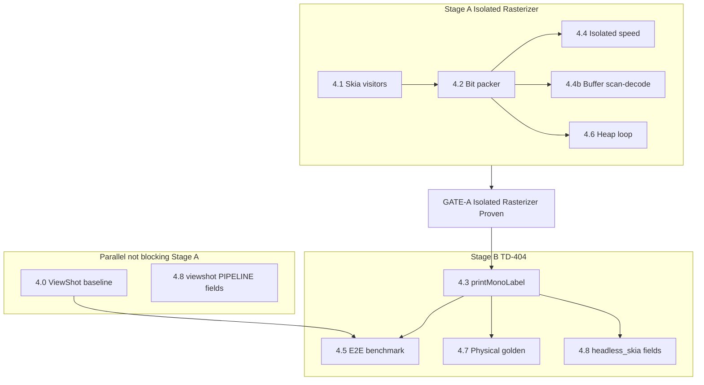

# Phase 4 Plan: Headless Skia Rasterizer + TD-404 Proof

**Status (this document):** Planning complete. No rasterizer or Kotlin work has started. Fold into [`ARCHITECTURE_REDESIGN_PLAN.md`](./ARCHITECTURE_REDESIGN_PLAN.md) only after a later, explicit fold-in task.

| Artifact | Status |
|---|---|
| This file | Source of truth for Phase 4 sequencing until fold-in |
| [`PERF_BASELINE.md`](./PERF_BASELINE.md) | **Does not exist.** Blocked on a real TD-404 ViewShot session. No placeholder numbers. |
| **GATE-A Isolated Rasterizer Proven** | **Not signed.** Stage B (4.3 / 4.5 / 4.7) is forbidden until a person signs this checkpoint after 4.1 + 4.2 + 4.4 + 4.4b + 4.6 all pass. |

**Sequential gating is non-negotiable.** The rasterizer is proven standalone (correct buffer, under 15 ms, no leaks) before any printer bridge consumes its output. Wiring TD-404 against an unproven rasterizer conflates Skia failures with transport failures.



---

## Verdict: TD-404 is the easiest bridge

Confirmed from source, not from the architecture narrative. This verdict only authorizes **which** bridge Stage B will use. It does **not** authorize starting Stage B before GATE-A.

- Live path is [`printPngLabel`](modules/td404-printer/android/src/main/java/expo/modules/td404printer/Td404PrinterModule.kt) → `printPngLabelNative`: Base64 PNG decode, optional rotate, scale to `floor(mm × dotsPerMm / 8) × 8`, luminance threshold (default 160) or Floyd–Steinberg, MSB-first pack, TSPL `BITMAP` mode 0, then `writeBytesToSocketSync` on our RFCOMM socket.
- Wire polarity already in that function: buffer prefilled `0xFF` (white = 1), black clears the bit (black = 0). MSB first (`bitIndex = 7 - (x & 7)`).
- [`printRaw`](modules/td404-printer/android/src/main/java/expo/modules/td404printer/Td404PrinterModule.kt) already writes a `ByteArray` through the same paced socket writer. A full TSPL job can be sent without a new entry point.
- [`encodeTscBitmapJob`](src/lib/printer/tsc.ts) already wraps a 1-bit raster in TSPL and XORs `0xFF`, so a black=1 logical buffer becomes the same black=0 wire format. It does **not** match the live header: JS emits `DIRECTION 0,0` and omits `SET TEAR ON` / `OFFSET 0 mm`; native emits `DIRECTION 1` plus those commands. Reusing the JS encoder unchanged would change print geometry versus today's TD-404 path.

Closest alternative is Dev (also contract B, hand-built TSPL). It is worse for this proof: writes go through AutoReplyPrint `CP_Port_Write`, `commandSet` can fall into ESC/POS, and width is capped near 378 dots. Josh, Label X, and Tez decode a PNG inside a vendor SDK and have no raw TSPL socket we own. Pull-forward stays TD-404.

---

## Stage A vs Stage B vs Stage C

| Stage | Work | Printer involved? |
|---|---|---|
| **A — Isolated rasterizer** | 4.1, 4.2, 4.4, 4.4b, 4.6 | No |
| **GATE-A** | Named sign-off: Isolated Rasterizer Proven | No |
| **B — TD-404** | 4.3, 4.5, 4.7 | Yes (4.3 source may be written only after GATE-A) |
| **C — Logging** | 4.8 | `viewshot` fields anytime; `headless_skia` fields after 4.3 |

### GATE-A — Isolated Rasterizer Proven (named checkpoint)

A person signs this off in writing (later fold-in / [`PROGRESS.md`](./PROGRESS.md)). Until then, Part 3 and Tasks **4.3, 4.5, and 4.7 do not start**. “4.2 buffer layout frozen” is **not** a substitute for GATE-A.

| Field | Value |
|---|---|
| Name | GATE-A Isolated Rasterizer Proven |
| Signed | **No** |
| Signer | — |
| Date | — |
| Evidence | 4.1 + 4.2 + 4.4 + 4.4b + 4.6 all passing on the frozen fixture, no printer |

GATE-A passes only when all of the following are true on the frozen fixture, with **no printer**:

- 4.1 visitors exist and draw using the barcode/QR correctness definition below.
- 4.2 packs MSB, black=1, byte-aligned rows.
- 4.4 isolated rasterize + bit-pack is under 15 ms on device.
- 4.4b Code128 and QR scan-decode from the **rasterized buffer** (expand 1-bit → image, decode; no print).
- 4.6 zero Hermes heap growth over 100 consecutive isolated rasterizations.

If speed, leak, or buffer correctness fails, fix it in Stage A. Do not proceed to Stage B.

**Task 4.0 is parallelizable.** It only exercises the **old ViewShot** path. It may run before, during, or after Stage A. It does **not** block 4.1. It **does** block 4.5 (nothing to compare against). Prefer capturing it early so Stage B is not waiting on a printer session after GATE-A.

---

## Part 1 — Baseline (ViewShot path; parallel with Stage A)

Capture procedure for a later [`PERF_BASELINE.md`](./PERF_BASELINE.md). Not a Stage A dependency. **Do not invent numbers.** Create that file only after ≥20 real prints.

### Frozen fixture (every number in this phase)

- Stock: 50.00 × 30.00 mm, gap, TD-404 profile 304 DPI → [`dotsPerMm`](src/lib/printer/print-spec.ts) returns **12**, so the page is **600 × 360** dots (already byte-aligned: 75 bytes/row).
- Elements, millimetres, origin top-left of the label:
  - Border: rectangle inset 1.0 mm, stroke 0.35 mm, black, no fill.
  - Text: box at (3, 3) mm, size 44 × 8 mm, `autoWrapping` not `Close`, string `Phase 4 baseline label 50x30 text wrap check`, left align, default family, `allowFontScaling` equivalent off.
  - Code128: box at (3, 12) mm, size 28 × 12 mm, payload `BASELINE50X30`, HRI bottom.
  - QR: box at (34, 12) mm, size 13 × 13 mm, payload `https://sez.print/baseline`, error level M, quiet zone `1`.

### Per-print metrics (≥20 repeats)

Same phone, same unit, app warm (one discarded print first):

- `capture_ms`: print tap → `captureRef()` resolve in [`src/app/print.tsx`](src/app/print.tsx) (today this is bundled with `ensureConnected` inside `capture+verify`; baseline splits them).
- `transport_write_ms`: native `writeMs` already returned by `printPngLabel` (`tWrite - tEncode`).
- `decode_ms` / `encode_ms`: already in that return map and in logcat `Td404Printer` `PRINT-TRACE`.
- `total_ms`: tap → `writeBytesToSocketSync` return.
- `hermes_heap_bytes`: `HermesInternal.getInstrumentedStats().js_heapSize` sampled immediately before capture and at peak after capture, if the runtime exposes it. If it does not, record `unavailable` and the Android `Debug.MemoryInfo` total PSS from a one-shot baseline log. Do not estimate.

Also record: phone model, Android version, Bluetooth advertised name, MAC, app git SHA, and firmware/model only if the unit or a sticker actually shows it. `addQueryPrinterType()` is undocumented ([`SDKS.md`](./SDKS.md) Q6); do not invent a firmware string. Dots/mm stays 12.0 until a caliper test says otherwise; baseline notes that assumption.

### Hardware needed (user)

A dev build (`npx expo run:android`, not Expo Go), a bonded TD-404/Tejas/Rudra with 50×30 gap stock, and logcat. This planning pass does not add baseline log lines until a capture build is requested.

### `PERF_BASELINE.md` template (fill only after the run)

```markdown
# PERF_BASELINE.md — TD-404 ViewShot path

- date:
- git_sha:
- phone_model:
- android_version:
- printer_advertised_name:
- printer_mac:
- firmware_or_variant: (only if labelled on the unit)
- dots_per_mm_assumed: 12.0
- fixture: 50x30 mm Phase 4 frozen label
- n: 20
- discarded_warmup: 1

| run | capture_ms | decode_ms | encode_ms | transport_write_ms | total_ms | hermes_heap_bytes |
|-----|------------|-----------|-----------|--------------------|----------|-------------------|
| 1   |            |           |           |                    |          |                   |

- capture_ms median / p95:
- transport_write_ms median / p95:
- total_ms median / p95:
- hermes_heap_bytes peak:
```

---

## Part 2 — Rasterizer plan (Stage A: Tasks 4.1–4.2)

New modules, not the existing gray engine. [`UniversalRenderer`](src/printing/renderer/UniversalRenderer.ts) plus [`text.ts`](src/printing/renderer/text.ts) is a 5×7 bitmap font and [`barcode.ts`](src/printing/renderer/barcode.ts) stretches normalized bar fractions (`bar.x * w`). That engine is not Phase 4 and must not become the print path.

API:

```ts
export function rasterizeDocumentToBitmap(
  doc: LabelDocument,
  dpi: number,
  options: RasterizeOptions
): {
  widthDots: number;
  heightDots: number;
  bytesPerRow: number;
  mono1bppBuffer: Uint8Array;
}
```

- Input: `LabelDocument`, `dpi` (304 → 12 dots/mm via `dotsPerMm`, never `304/25.4`).
- Surface: `Skia.Surface.MakeOffscreen(widthDots, heightDots)` from installed `@shopify/react-native-skia` 2.2.12. Confirm `MakeOffscreen` and `Paragraph` on that version at implementation time; [`skia-element-renderer.tsx`](src/components/editor/skia-element-renderer.tsx) already imports the package.
- Draw pure black or white. No grayscale except images, which are blitted then thresholded at **160** to match native `printPngLabel`. Fixture has no image, so the 15 ms path does no dither.
- Page size uses the same pack-down as native: `packedW = max(8, floor(sizeDotsW / 8) * 8)`, `packedH = sizeDotsH`. Negative offsets are baked into pixels before `BITMAP 0,0`, same as native.

### Element drawing

- **Text (highest visual-parity risk vs the editor).** Skia `Paragraph` with width = element width in dots, `matchFont` via the same `resolveFontFamily` the editor uses, `allowFontScaling` ignored (system font scale must not apply). `autoWrapping === 'Close'` → one line, clip. Otherwise wrap on that width. `verticalDisplay` → one character per line, matching [`TextContent`](src/components/editor/element-renderer.tsx). Align left / center / right; `spacing` maps to justify as the editor does. Multi-line wrap is checked by **line-break indices and line count** against a fixture, not by hoping glyphs match Android `TextView`.
- **1D barcode.** See correctness definition below. Call `snap1DBarcodeModules(rawModules, widthMm, jobDpi, false)` and fill `Rect`s at `originDotX + bar.dotX` by `bar.dotWidth`, height in dots. Do not multiply `bar.x * widthPx`.
- **QR / DataMatrix / PDF417.** Build the matrix with the existing encoders (`generateQrMatrix`, `encodeDataMatrix`, `encodePdf417`), then call `snap2DMatrixToHardwareDots` and paint each black module as an N×N dot rect at the returned `dotSize`, plus `offsetXMm` / `offsetYMm` converted with `dotsPerMm`. Do not recompute module size.
- **Shapes, lines, borders.** Skia paths. Stroke width = `max(1, round(mm * dotsPerMm))`. Axis-aligned borders snap to integer dots.
- **Images.** `Skia.Image` scaled into the element rect, then threshold 160. Dither only when the job already requests it; the fixture does not.
- Every other `ElementType` (`table`, `time`, `arctext`, `degrees`, `clipart`, `signature`) either has a visitor or **fails the print**. Silent skip is not allowed. The gate fixture only contains text, barcode, QR, and border.

### Barcode “correctness” — Task 2.3 contradiction, resolved for Stage A

[`PROGRESS.md`](./PROGRESS.md) Task 2.3 (dated 2026-09-19) states that [`BarcodeContent`](src/components/editor/element-renderer.tsx) replaced floating-point `bar.x * widthPx` with integer-dot-aligned `snapped.bars`. **That claim does not match current source.** Verified when this plan was written:

- `snap1DBarcodeModules(rawModules, widthMm, 203, false)` — DPI is hardcoded **203**, quiet zone off.
- SVG still draws `bar.x * widthPx` / `bar.width * widthPx` with `preserveAspectRatio="none"`. `dotX` / `dotWidth` are unused.
- `snap2DMatrixToHardwareDots` is not called from `QrcodeContent`; 2D codes are module-index SVG paths stretched with `preserveAspectRatio="meet"`.

Stage A does **not** wait on fixing the editor. Phase 4 print output is defined as the **integer-dot snap at job DPI**, not a pixel match to ViewShot.

**Correct 1D (Stage A 4.4b):** `snap1DBarcodeModules(rawModules, widthMm, jobDpi, false)` — same `includeQuietZone: false` as the live element (tight box), but `jobDpi` is **304** on the TD-404 fixture, never 203. Paint `bar.dotX` / `bar.dotWidth` in printer dots. Expanding the packed buffer to an image and decoding with the existing independent decoder / ZXing path must yield `BASELINE50X30`.

**Correct 2D (Stage A 4.4b):** existing encoder matrix + `snap2DMatrixToHardwareDots` at job DPI. Decode of the expanded buffer must yield `https://sez.print/baseline`.

Re-deriving module sizes inside the rasterizer is out of scope. Aligning `element-renderer.tsx` to `dotX`/`dotWidth` is a separate editor follow-up, not GATE-A and not Stage B.

A bit-identical diff against ViewShot is **not** a Stage A gate. Physical golden (4.7) is Stage B only.

### Bit pack (Task 4.2)

Logical buffer before TSPL invert:

- 8 pixels → 1 byte, MSB first: `(p0<<7)|(p1<<6)|...|p7`.
- Set bit = black (ink). Matches [`thresholdGray`](src/printing/raster/bitmap.ts).
- Row width `bytesPerRow = packedW / 8`. Trailing bits in a short row stay 0 (white) in the logical buffer.
- Native splice or `encodeTscBitmapJob`'s `^ 0xFF` produces wire black=0 / white=1. Invert in exactly one place, and only when encoding TSPL (Stage B). Stage A tests the logical buffer.

### Stage A checks (no printer)

- 4.4b: QR and Code128 scan-decode from the expanded buffer.
- Text: both wrapped lines of the frozen string; line-break indices match the Paragraph fixture.
- Border: closed rectangle, stroke ≥ 1 dot, inset 1 mm (12 dots at 12 dots/mm) in the buffer.

---

## Part 3 — TD-404 integration (Stage B only, after GATE-A)

**Hard start condition:** GATE-A signed off. If GATE-A has not passed, do not add `printMonoLabel`, do not flip the feature flag, do not print the rasterizer buffer.

Prefer a **new** native entry point `printMonoLabel` beside `printPngLabel`, not a branch inside the PNG decoder.

- Inputs: `monoBytes` (`ByteArray`), `widthDots`, `heightDots`, `bytesPerRow`, plus the existing job fields (`widthMm`, `heightMm`, `gapMm`, `density`, `speed`, `copies`, `media`, `direction` default **1**, `xDots`, `yDots`).
- Reject unless `monoBytes.length == bytesPerRow * heightDots` and `bytesPerRow * 8 == packedW`.
- Invert logical black=1 → wire black=0 once, then reuse the existing header string in `printPngLabelNative` (`SIZE`, `GAP`/`BLINE`, `SPEED`, `DENSITY`, `DIRECTION`, `SET TEAR ON`, `OFFSET 0 mm`, `REFERENCE 0,0`, `CLS`, `BITMAP x,y,bytesPerRow,height,0,`, `PRINT 1`) and `writeBytesToSocketSync`.
- No `BitmapFactory`, no scale, no threshold, no dither on this path.
- `printPngLabel` stays as it is.

`printRaw` plus a corrected JS header is a fallback if we want zero Kotlin for the first hardware try. It is not the planned contract: the header must match native `DIRECTION 1`, and the bridge fallback in [`printTd404Raw`](modules/td404-printer/src/index.ts) base64-encodes on failure, which hides timing. A dedicated entry returns `writeMs` without a PNG.

Isolation: a dev-only flag, default **off**, read only in the `usesTd404CommandSet` branch of [`src/app/print.tsx`](src/app/print.tsx). Off → today's `tryNativeSdkPngPrint`. On → rasterize then `printMonoLabel`. Other SDKs stay on ViewShot. Flag off is the rollback.

A 50×30 job is 27,000 payload bytes, under the 32 KB fast-write cutoff in `writeBytesToSocketSync`.

---

## Part 4 — Benchmark harness (design only)

Two measurements, same fixture, **different stages**:

1. **Isolated (Stage A, Task 4.4):** `LabelDocument` → 1-bit buffer, no socket. Clock is rasterize + bit-pack only. Gate: under 15 ms. Run on the same phone class as the baseline when the phone is available; GATE-A still requires an on-device number, not a laptop estimate. The architecture doc's 1440×960 case is an extra stress log, not this gate.
2. **End-to-end (Stage B, Task 4.5):** tap → bytes flushed, same unit and fixture as Part 1. Compare to `PERF_BASELINE.md` `total_ms` median and p95. Transport time is reported separately so a slow RFCOMM link is not blamed on Skia. **Forbidden until GATE-A and 4.0.**

Memory (Stage A, Task 4.6): 100 isolated rasterizations in a loop, one reused output buffer, `HermesInternal.getInstrumentedStats().js_heapSize` before and after. Gate: no growth beyond allocator noise (treat ≤ 0 as pass; if the counter is quantized, require the after-sample ≤ before-sample). Force a GC between the warmup and the measured 100 if the runtime allows; document the call.

Parity is two steps so printer and Skia stay separable:

- **Stage A (4.4b):** expand the logical 1-bit buffer to an image; decode QR/Code128. No golden file from a printer yet.
- **Stage B (4.7):** after a signed-off physical print, write `fixtures/phase4/label-50x30-td404-304.1bpp` from the buffer that was sent, plus a JSON sidecar (width, height, bytesPerRow, git SHA, phone, printer name). CI then `memcmp`s. A photo of the label is not a bitmap diff: thermal dot gain cannot be 100% bit-identical. The physical proof is the sign-off that creates the golden file.

---

## Part 5 — Merge-blocking gates

If any gate fails, the phase is not done, regardless of how much else works. Stage B gates are not in play until GATE-A passes.

**GATE-A (blocks 4.3 / 4.5 / 4.7):**

| Gate | Threshold |
|---|---|
| Isolated buffer scan-decode | Code128 `BASELINE50X30`, QR `https://sez.print/baseline` |
| Isolated rasterize + bit-pack | Under 15 ms on the fixture |
| Memory | Zero Hermes heap growth across 100 consecutive isolated rasterizations |

**Stage B (blocks calling the phase done):**

| Gate | Threshold |
|---|---|
| Visual/binary parity | 100% byte match of the rasterizer buffer to the signed-off physical-proof fixture; Code128 and QR must scan on that same print |
| TD-404 end-to-end | Median tap-to-bytes-sent strictly less than the Part 1 baseline median on the same phone and printer. A fast rasterizer with a slower total is a failure. |

---

## Part 6 — Structured log

One machine-readable line per print, via [`logPrintTrace`](src/printing/trace.ts) (already `key=value`). Stage name: `PIPELINE`.

**Stage C split:**

- `path=viewshot` fields can land with Task 4.0 (needed for baseline). Do not wait for GATE-A.
- `path=headless_skia` fields land only after Task 4.3 exists.

Emitted from the TD-404 branch in [`src/app/print.tsx`](src/app/print.tsx) after native write returns.

| Field | Meaning |
|---|---|
| `path` | `viewshot` or `headless_skia` |
| `rasterize_ms` | Skia draw; `0` on viewshot |
| `bitpack_ms` | pack loop; on viewshot this is native `encodeMs` (threshold + pack) |
| `decode_ms` | PNG decode; `0` on headless |
| `transport_write_ms` | native `writeMs` |
| `total_ms` | tap to write return |
| `buffer_bytes` | payload size |
| `width_dots` | packed width |
| `height_dots` | packed height |
| `bytes_per_row` | `width_dots / 8` |
| `gate_15ms` | `pass` or `fail` from `rasterize_ms + bitpack_ms < 15` (headless only; viewshot logs `n/a`) |

---

## Part 7 — Tasks

### Stage A — Isolated rasterizer (no printer)

- **4.1 Skia surface and element visitors.** Scope: offscreen draw for text, snapped barcode (`dotX`/`dotWidth` at job DPI), snapped 2D, shapes, lines, borders, images; unsupported types throw. Depends on: buffer contract above. Does **not** depend on 4.0. Hardware: no for unit tests; on-device only if Skia offscreen cannot run in CI. Estimate: 3–4 days (text wrap is most of this).
- **4.2 Bit packer.** Scope: MSB, black=1, byte-aligned rows. TSPL invert is Stage B. Depends on: 4.1 pixel readback. Hardware: no. Estimate: 0.5 day.
- **4.4 Isolated benchmark.** Scope: fixture in, buffer out, 15 ms assertion, no socket. Depends on: 4.1 and 4.2. Hardware: the 15 ms number is on device; CI can assert a looser host ceiling. Estimate: 0.5 day.
- **4.4b Isolated buffer scan-decode.** Scope: expand packed buffer to an image; decode Code128 and QR against the frozen payloads. This is Stage A’s definition of a “correct” buffer (see Task 2.3 resolution). Depends on: 4.1 and 4.2. Hardware: no. Estimate: 0.5 day.
- **4.6 Heap loop.** Scope: 100 consecutive isolated rasterizations, zero heap growth. Depends on: 4.1 and 4.2. Hardware: yes for Hermes stats (same phone class as 4.4). Estimate: 0.5 day.

### Checkpoint — GATE-A Isolated Rasterizer Proven

Sign-off required: 4.1 + 4.2 + 4.4 + 4.4b + 4.6 all passing. **4.3, 4.5, and 4.7 list this checkpoint as a hard dependency**, not “4.2 buffer layout frozen.”

Current state: **not signed.**

### Parallel (does not block Stage A)

- **4.0 Baseline capture.** Scope: log splits and `PERF_BASELINE.md` from ≥20 prints of the frozen fixture on the **current ViewShot** path. Depends on: nothing in Stage A. Hardware: yes. Estimate: 0.5 day once the phone and printer are in hand. Blocks 4.5 only. **Not started — needs device, printer, and a capture build.**
- **4.8a `PIPELINE` viewshot fields.** Scope: Part 6 fields with `path=viewshot`. Depends on: none. Can ship with 4.0. Hardware: no.

### Stage B — TD-404 (only after GATE-A)

- **4.3 `printMonoLabel` + flag.** Scope: new Kotlin entry, JS wrapper, flag default off, header identical to live `printPngLabel`. Depends on: **GATE-A**. Hardware: yes, one proof print after the entry exists. Estimate: 1 day.
- **4.5 End-to-end TD-404 benchmark.** Scope: same fixture and unit as 4.0, compare medians. Depends on: **GATE-A**, 4.3, and 4.0. Hardware: yes. Estimate: 0.5 day.
- **4.7 Golden 1-bit fixture.** Scope: save the buffer from the accepted physical proof; byte-compare test. Depends on: **GATE-A**, 4.3, and a human sign-off print. Hardware: yes to create the file; no to re-check it. Estimate: 0.5 day plus however long physical-parity fixes take (budget 2 days of redraw fixes before calling the gate failed). Redraw fixes that fail 4.4b must return to Stage A (GATE-A is revoked until 4.4b passes again).
- **4.8b `PIPELINE` headless_skia fields.** Scope: remaining Part 6 fields. Depends on: 4.3. Hardware: no.

### Stage C remainder

- **4.8** is 4.8a + 4.8b. The phase logging story is incomplete until both exist; 4.8a may land weeks earlier.

### Dependency summary

| Task | Hard dependencies | Hardware to verify? |
|---|---|---|
| 4.1 | None | No (unless Skia offscreen needs a device) |
| 4.2 | 4.1 | No |
| 4.4 | 4.1, 4.2 | Yes for the 15 ms number |
| 4.4b | 4.1, 4.2 | No |
| 4.6 | 4.1, 4.2 | Yes (Hermes) |
| **GATE-A** | 4.1, 4.2, 4.4, 4.4b, 4.6 | On-device for 4.4 and 4.6 |
| 4.0 | None (parallel) | Yes (TD-404 ViewShot) |
| 4.8a | None | No |
| 4.3 | **GATE-A** | Yes after the entry exists |
| 4.5 | **GATE-A**, 4.3, 4.0 | Yes |
| 4.7 | **GATE-A**, 4.3, physical sign-off | Yes to create; no to re-check |
| 4.8b | 4.3 | No |
